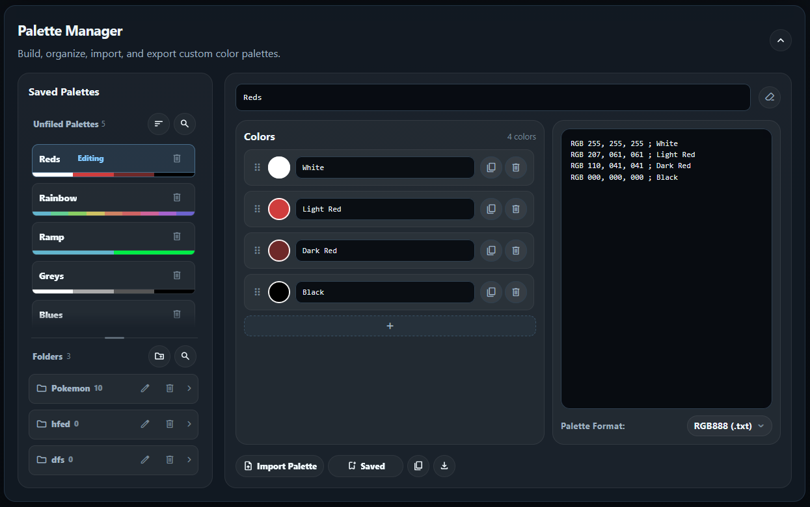

# RetroColorLab

**A local-first color workflow for pixel art and retro game graphics.**

RetroColorLab converts constrained color formats, extracts and remaps sprite colors in real time, and builds reusable palette libraries—all in the browser. Uploaded artwork and saved palettes stay on the user's device; there is no account, backend, build pipeline, or server-side image processing.

**Current implementation:** July 20, 2026

**[Open the live application →](https://mwalton1204.github.io/RetroColorLab/)**

## Engineering highlights

- **Real-time pixel processing:** deduplicates opaque source colors from `ImageData` and recolors pixels through an RGB lookup map.
- **Shared color pipeline:** one parser and formatter supports RGB888, RGB555, RGB565, RGB444, and HEX across every tool.
- **Local-first persistence:** palettes, color names, folders, and manual ordering are stored in IndexedDB.
- **Interoperable palette files:** reads and writes JASC PAL, GIMP GPL, and plain-text RGB formats without assuming that a `.pal` extension identifies its encoding.
- **Pixel-art-safe previewing:** uses integer-only 1×, 2×, and 4× display scaling with disabled image smoothing.
- **Framework-free architecture:** vanilla JavaScript, Canvas, IndexedDB, semantic HTML, and CSS; no bundler or installation step.

## Core tools

### 1. Color Format Converter


Convert a single color between RGB888, RGB555, RGB565, RGB444, and HEX. Input and output formats are independent, the preview uses the same shared color-picker component as the rest of the application, and the result can be copied immediately.

### 2. Sprite Lab


Sprite Lab turns an uploaded PNG, JPEG, WebP, or GIF into an editable color map. It detects unique non-transparent colors, renders original and recolored canvases side by side, and applies changes without re-uploading the source image.

Key capabilities include:

- Real-time recoloring with individual reset controls and full-palette grayscale conversion.
- Drag-reordered colors, persistent names, shared round color pickers, and scroll-aware visual cues.
- Canvas color inspection: hover a source pixel to highlight its palette row, click to pin it, and press Escape to clear the selection.
- Editable palette text synchronized with the color controls.
- JASC, GIMP, RGB888, RGB555, RGB565, and RGB444 palette output.
- Saved-palette search, sorting, loading, and semantic white/black slot matching.
- Recolored PNG download and crisp integer 1×, 2×, and 4× preview scaling.

### 3. Palette Manager



Palette Manager is a full local palette library, not just an export form. Users can create named colors, edit the palette as controls or text, import ambiguous palette files with an explicit format choice, and reopen saved palettes for debounced autosaving.

Key capabilities include:

- Required palette names, editable color names, synchronized palette text, and shared file-format support.
- Copy, download, format-aware import, autosave, delete confirmation, and universal toast feedback.
- Searchable and sortable unfiled palettes with compact ordered color-strip previews.
- Collapsible folder cards with create, rename, and delete workflows.
- Persistent drag-and-drop ordering for folders and palettes inside folders; cross-folder moves remain supported.
- Independent, resizable library viewports with overflow fades and scrollbars.
- A shared IndexedDB library that is immediately available inside Sprite Lab.

## Architecture and implementation

The application is organized as small browser modules with shared format, export, storage, picker, and UI layers. Tool controllers own their DOM state, while common data transformations remain independent of the interface.

Important implementation choices:

- Sprite recoloring works from an immutable source `ImageData` snapshot, preventing cumulative color degradation across edits.
- Palette text and visual controls pass through the same normalized RGB888 color model.
- Reopened palettes debounce routine saves and flush pending changes before switching records.
- Folder deletion uses one IndexedDB transaction to remove the folder and preserve its palettes by moving them to Unfiled.
- Drag ordering is stored as numeric positions rather than inferred from names or timestamps.
- Fixed, page-level toasts provide feedback without changing document layout.

## IndexedDB table design

Database: `retropalettelab` · Version: `2`

### `palettes`

| Field | Type | Purpose |
|---|---|---|
| `id` | Number | Auto-incrementing primary key |
| `name` | String | Required display name |
| `savedAt` | ISO date string | Last save time; supports date sorting |
| `colors` | Array | Ordered color records, including replacement HEX and color name |
| `hasWhite` / `hasBlack` | Boolean | Preserves semantic endpoint slots for sprite palette matching |
| `source` | String | Identifies the creating workflow when supplied |
| `folderId` | Number or `null` | Application-managed reference to `paletteFolders.id`; `null` means Unfiled |
| `folderOrder` | Number | Persistent position within a folder |

### `paletteFolders`

| Field | Type | Purpose |
|---|---|---|
| `id` | Number | Auto-incrementing primary key |
| `name` | String | User-defined folder name |
| `createdAt` | ISO date string | Stable creation metadata and fallback ordering |
| `sortOrder` | Number | Persistent folder-card position |

The stores intentionally use a small document-style schema. Palette-to-folder relationships are maintained in application transactions, which keeps records portable and makes folder deletion behavior explicit.

## Selected key functions

Only the functions central to the engineering story are listed here.

| Function | Responsibility |
|---|---|
| `parsePalette()` | Validates and normalizes RGB888, RGB555, RGB565, RGB444, and HEX input |
| `formatOutput()` | Converts the normalized color model into the selected representation |
| `buildPaletteFiles()` | Produces interoperable JASC, GIMP, RGB text, HEX, CSV, and manifest content |
| `parsePalettePreviewText()` | Parses editable or imported palette text back into normalized colors |
| `renderSwapControls()` | Reconciles Sprite Lab mappings with interactive rows and color-picker instances |
| `recolorSprite()` | Applies the current replacement map to source pixels and redraws the preview canvas |
| `renderLibrary()` | Builds the searchable, folder-aware Palette Manager library and its scroll states |
| `reorderPalettesInFolder()` | Persists palette moves and positions in a single IndexedDB transaction |
| `reorderPaletteFolders()` | Persists user-defined folder ordering |
| `showToast()` | Routes application feedback through one non-layout-shifting notification surface |

## Project file architecture

```text
retropalettelab/
├── index.html                 # Semantic application shell, dialogs, and tool panels
├── css/
│   └── styles.css             # Responsive layout and shared component/state styling
├── js/
│   ├── main.js                # Initialization, reload cleanup, and collapsible sections
│   ├── converter.js           # Color Format Converter controller
│   ├── sprite-recolorer.js    # Sprite analysis, Canvas recoloring, preview, and palette workflow
│   ├── palette-builder.js     # Palette editor, folder library, autosave, and drag interactions
│   ├── color-formats.js       # Shared color validation, normalization, and conversion
│   ├── palette-export.js      # Palette ordering, serialization, and text parsing
│   ├── palette-storage.js     # IndexedDB schema and transactional persistence
│   ├── pickr-enhancements.js  # Shared format-aware color-picker adapter
│   ├── format-menus.js        # Accessible custom format-menu behavior
│   └── ui-utils.js            # Toasts, clipboard, filenames, escaping, and Canvas blobs
├── assets/
│   ├── ConverterScreenshot.png
│   ├── SpriteLabScreenshot.png
│   └── PaletteManagerScreenshot.png
├── ROADMAP.md                 # Current TODO and deferred work
└── LICENSE                    # MIT license
```

## Run locally

RetroColorLab has no package installation or build command. Open `index.html` directly, or serve the directory locally:

```bash
python -m http.server 8000
```

Then visit `http://localhost:8000`.

## Browser APIs and dependencies

| Technology | Role |
|---|---|
| Canvas 2D / `ImageData` | Pixel inspection, color extraction, recoloring, and PNG output |
| IndexedDB | Persistent palettes, folders, metadata, and manual ordering |
| FileReader / Blob / Object URLs | Local import and download workflows |
| [Pickr](https://github.com/Simonwep/pickr) | Color-picker UI, extended with RetroColorLab format fields |
| [JSZip](https://stuk.github.io/jszip/) | Client-side ZIP generation for export workflows |
| [Material Symbols](https://fonts.google.com/icons) | Consistent interface iconography |

Uploaded images and palette files are processed locally and are never sent to an application server.

## Next steps

See [ROADMAP.md](ROADMAP.md) for the focused TODO list and deferred ideas.

## License

MIT © 2026 Michael Walton
