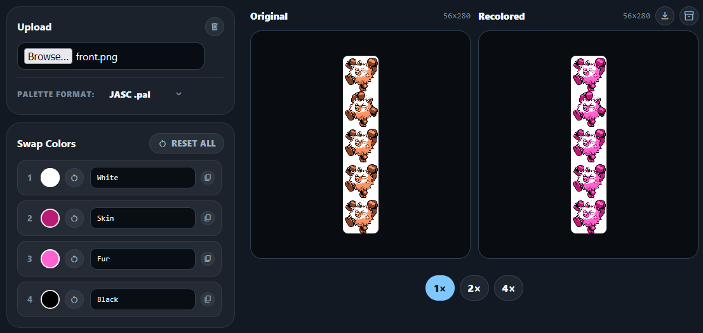

# RetroColorLab

A browser-based toolkit for retro palette workflows. Convert color values between common formats, upload sprite images to detect and swap colors automatically, and export palette files ready for use in your editor. No server, no build step, no data sent anywhere.

Built for retro game developers, pixel artists, and ROM hackers working with constrained-color systems like Game Boy Color, GBA, NES, and SNES.

**[Live demo →](https://mwalton1204.github.io/RetroColorLab/)**



---

## Features

### Palette Converter
- Convert a single color between **RGB555, RGB888, RGB565, RGB444, and HEX**
- Integrated color picker with custom format input fields injected directly into the Pickr UI. Supports typing values in any supported format, not just hex
- Input and output format selectable independently

### Sprite Recolor
- Upload any PNG, JPEG, WebP, or GIF image
- All unique non-transparent colors are detected automatically via the Canvas API and mapped to individual color pickers
- Swap any color in real time and preview updates instantly
- Per-color name labels, editable inline
- Editable palette file preview: paste values from an external source to apply them back to the sprite
- Exclude black and white from exports with a toggle
- 1×, 2×, 4× zoom for pixel-accurate inspection

### Palette Export (ZIP package)
- **JASC .pal** — Paintshop Pro / GraphicsGale
- **GIMP .gpl** — GIMP palette format
- **RGB888 / RGB555 / RGB565 / RGB444 .txt** — plain-text numeric formats
- **Indexed grayscale PNG** — a canvas-generated grayscale image where each pixel's brightness encodes its palette index, for use with external palette-mapping workflows
- All files bundled into a ZIP via JSZip, generated entirely in the browser

---

## Technical notes

- **Vanilla JS, no framework, no build step.** Plain `<script>` tags loaded in dependency order. The codebase is split into focused modules (`color-formats.js`, `converter.js`, `sprite-recolorer.js`, `palette-export.js`, etc.) without requiring a bundler.
- **Custom Pickr format fields.** The Pickr color picker normally only accepts hex input. A custom UI is injected into each picker instance after initialization, adding a format selector and text input that parses and applies any supported color format directly.
- **Canvas-based color detection.** Sprite colors are extracted by reading raw `ImageData` pixel-by-pixel, keyed by RGB triplet, and deduplicated into a sorted palette. Recoloring applies a replacement map over the same `ImageData` in a single pass.
- **Client-side ZIP generation.** The indexed export package (PNG + all palette files) is assembled and zipped entirely in the browser using JSZip, then offered as a download via a temporary object URL.
- **Zero data transmission.** Uploaded images are read with `FileReader` and processed locally. Nothing is sent to a server.

---

## Run locally

Open `index.html` directly in a browser, or serve the folder:

```bash
python -m http.server 8000
# then open http://localhost:8000
```

Both work — no server is required.

---

## Project structure

```
retrocolorlab/
├── index.html
├── css/
│   └── styles.css
└── js/
    ├── main.js               # Entry point — wires converter, sprite recolorer, format menus
    ├── color-formats.js      # Color parsing and formatting for all supported formats
    ├── converter.js          # Palette converter section logic
    ├── sprite-recolorer.js   # Sprite upload, color detection, swap UI, export
    ├── palette-export.js     # Palette file generation (JASC, GIMP, txt, indexed PNG)
    ├── format-menus.js       # Dropdown menu open/close behavior
    ├── pickr-enhancements.js # Custom format fields injected into Pickr instances
    └── ui-utils.js           # Shared utilities (toast, clipboard, canvas blob, etc.)
```

---

## Dependencies

Loaded via CDN — no npm install required:

| Library | Purpose |
|---|---|
| [Pickr](https://github.com/Simonwep/pickr) | Color picker UI |
| [JSZip](https://stuk.github.io/jszip/) | Client-side ZIP generation |
| [Material Symbols](https://fonts.google.com/icons) | Icon font |

---

## License

MIT © 2026 Michael Walton
