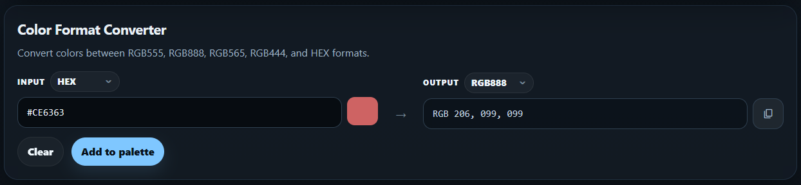
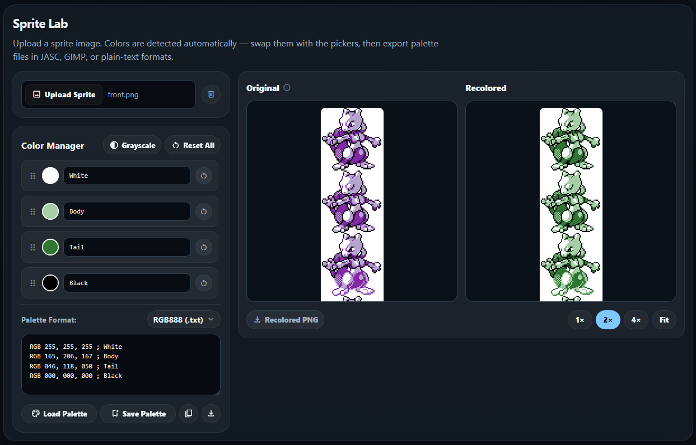

# RetroColorLab

RetroColorLab is a client-side toolkit for the color workflows behind pixel art and retro games. It combines color-format conversion, reusable palette management, and real-time sprite recoloring in one focused interface.

The project is built with vanilla JavaScript and the Canvas API. Images and palettes are processed locally, saved palettes persist in IndexedDB, and the application requires no account, backend, build step, or server-side image handling.

It is designed for pixel artists, retro game developers, and ROM hackers working with constrained-color systems such as the Game Boy Color, GBA, NES, and SNES.

**[Live demo →](https://mwalton1204.github.io/RetroColorLab/)**

---

## Project highlights

- **A complete browser-based workflow:** convert retro color formats, build reusable palettes, apply them to sprites, and export the result without leaving the page
- **Purpose-built image processing:** unique sprite colors are detected from raw pixel data and recolored in real time through an efficient lookup-based canvas pass
- **Pixel-art-aware previews:** zoom modes use integer scaling so artwork remains crisp and representative at every supported size
- **Shared application state:** palettes created manually or extracted from sprites use the same IndexedDB-backed library and can move between tools
- **Privacy by design:** uploaded artwork never leaves the browser

---

## Features

### Color Format Converter



- Convert individual colors between **RGB888, RGB555, RGB565, RGB444, and HEX**
- Choose input and output formats independently
- Enter a value manually or use the integrated color picker
- Copy the converted value with one click

### Sprite Lab



- Upload or drag and drop PNG, JPEG, WebP, and GIF images
- Detect every unique non-transparent color automatically
- Replace colors with individual color pickers and see the recolored sprite update immediately
- Rename palette entries inline
- Drag and drop colors to rearrange their palette order
- Reset an individual color or the entire palette
- Convert the complete working palette to grayscale with one click
- Hover over the original sprite to highlight its matching color row; click to pin the selection and press Esc to clear it
- Compare the original and recolored images side by side
- Inspect pixel art at integer-only **1×, 2×, 4×, or Fit** scaling
- Download the recolored image as a PNG

### Sprite Palette Tools

- View and edit the working palette as text; valid edits are applied back to the recolored sprite
- Select **JASC (.pal), GIMP (.gpl), RGB888, RGB555, RGB565, or RGB444** palette output
- Copy or download the current palette in the selected format
- Save the current sprite palette to the shared local palette library, using the sprite filename as the suggested palette name
- Load a saved palette from the library and apply it to the current sprite
- Match white and black entries semantically when applying compatible saved palettes

### Palette Manager

- Create required-name palettes without uploading a sprite
- Add and edit colors directly in the Palette Manager
- Edit colors with the same picker and inline value controls used by Sprite Lab's Color Manager
- Drag colors to reorder them, or copy and delete individual entries with compact row actions
- View and edit a synchronized text representation of the working palette
- Select **JASC (.pal), GIMP (.gpl), RGB888, RGB555, RGB565, or RGB444** palette output
- Copy or download the complete palette in the selected format
- Import `.pal`, `.gpl`, and `.txt` files, then explicitly select the format used by the file contents before parsing
- Save new palettes locally in IndexedDB; changes to reopened palettes autosave after edits
- Search and sort saved palettes by date, name, or color count
- Preview every saved palette as an ordered, evenly divided color strip
- Reopen or delete saved palettes from the full-height, independently scrollable library
- Share the same saved-palette library with Sprite Lab

---

## Implementation highlights

RetroColorLab uses a small, dependency-light architecture organized around focused JavaScript files rather than a framework or bundler.

- **Canvas-based recoloring:** images are read into `ImageData`, unique opaque RGB values are deduplicated, and replacement colors are applied through a lookup map in a single pass
- **Shared color model:** the converter, Sprite Lab, and Palette Manager use the same parsing and formatting utilities for RGB888, RGB555, RGB565, RGB444, and HEX
- **Format-aware color controls:** Pickr is extended with custom inputs that understand the project's retro color formats instead of accepting only HEX
- **Persistent local library:** IndexedDB stores named palettes created in Palette Manager or captured from Sprite Lab; reopened Palette Manager entries use debounced autosaving and flush pending edits before switching palettes
- **Shared palette file pipeline:** Palette Manager and Sprite Lab use the same JASC, GIMP, RGB888, RGB555, RGB565, and RGB444 generation and parsing utilities
- **Explicit import interpretation:** Palette Manager asks which format is stored inside an imported file instead of assuming its encoding from an ambiguous extension such as `.pal`
- **Semantic palette matching:** saved sprite palettes retain information about white and black slots so those colors can be matched by identity when applied to another sprite
- **Responsive integer scaling:** Fit mode calculates the largest whole-number scale supported by the available preview area
- **Client-side privacy:** `FileReader`, Canvas, and IndexedDB keep uploaded artwork and user-created palettes on the device

---

## Run locally

Open `index.html` directly in a browser, or serve the project directory with a simple local server:

```bash
python -m http.server 8000
```

Then open `http://localhost:8000`.

No installation or build command is required.

---

## Project structure

```text
retropalettelab/
├── index.html
├── css/
│   └── styles.css
└── js/
    ├── main.js               # Application initialization
    ├── color-formats.js      # Shared color parsing and formatting
    ├── converter.js          # Color Format Converter behavior
    ├── sprite-recolorer.js   # Sprite detection, recoloring, preview, and palette workflow
    ├── palette-builder.js    # Standalone Palette Manager and saved-palette library
    ├── palette-export.js     # Palette file generation and parsing
    ├── palette-storage.js    # IndexedDB palette persistence
    ├── format-menus.js       # Custom format-selector behavior
    ├── pickr-enhancements.js # Format-aware Pickr controls
    └── ui-utils.js           # Shared browser and interface utilities
```

---

## Dependencies

Dependencies are loaded from a CDN; no npm install is required.

| Library | Purpose |
|---|---|
| [Pickr](https://github.com/Simonwep/pickr) | Color picker interface |
| [Material Symbols](https://fonts.google.com/icons) | Interface icons |

---

## TODO

See [ROADMAP.md](ROADMAP.md) for the current task list and deferred ideas.

---

## License

MIT © 2026 Michael Walton
